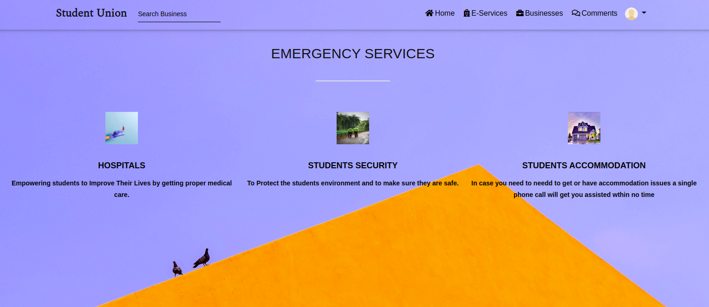

# STUDENT UNION
### 7.12.2020

## Author

[Hassan Juma ](https://github.com/HASSAN1A)

#### A Django CRUD web app that Connects students across Kenya.

#### Landing Page

Currently deployed at heroku and working.

#### Mobile support
The WebApp is compatible with devices of all sizes and all OS's, and consistent improvements are being made.

#### Get Live link here : [USAGE](https://studentunionhs.herokuapp.com/)

## Description
This web app where students connect and join student unions of their respective institutions and get to know various services i.e business opportunities offered or available in their respective institutions so that they can take part and get a means of survival.The students will also get to know more information concerning accomodation,security and hospital so that they get affordable or free healthcare or leave in a secure enviroment. 

## User Story
      As a user, you can:
1. Sign in with the application to start using.
2. Set up a profile about yourself and a general institution and union.
3. Find a list of different businesses in his/her respective institution or union.
4. Find Contact Information for the health department and Security in their respective institutions wherever they are.
5. Create Posts that will be visible to everyone in the site.
6. Change My union when you decide to change institutions.
7. Only view details of a single union.

## Installation and Set-up
Here is a run through of how to set up the application:
* **Step 1** : Clone this repository using **`https://github.com/HASSAN1A/Student-Union.git`**, or downloading a ZIP file of the code.
* **Step 2** : The repository, if downloaded as a .zip file will need to be extracted to your preferred location and opened
* **Step 3** : Go to the project root directory and  create a virtual environment. Run the following commands respectively:
    * **`python3.8 -m venv --without-pip virtual`**
    * **`source virtual/bin/activate`**
        * Note that you can exit the virtual environment by running the command **`deactivate`**
* **Step 4** :  Download the latest version of pip in virtual our environment. 
    * **`curl https://bootstrap.pypa.io/get-pip.py | python`** 

* **Step 5** : Download the all dependencies in the requirements.txt using **`pip install -r requirements.txt`**
* **Step 6** : Create the Database
    * - psql
    * - CREATE DATABASE students;
* **Step 7** : .env file
    * Create .env file and paste paste the following filling where appropriate:

    * - SECRET_KEY = '<Secret_key>'
    * - DBNAME = '<DB_NAME>'
    * - USER = '<USER_>'
    * - PASSWORD = '<Password>'
    * - DEBUG = True
* **Step 8** : Run initial Migration
    * python3 manage.py makemigrations
    * python3 manage.py migrate
* **Step 10** : Create admin credentials
    * python3 manage.py createsuperuser
  
* **Step 11** : Run application
    * python3 manage.py runserver
    * Open your preferred browser and view the app by opening the link **http://127.0.0.1:8000/**.

## Running the process
* . virtual/bin/activate
* To open local server run python3 manage.py runserver
* To run the test,run python manage.py test Student-Union

## Features

Here are the summary:

- A landing page showing users and their profile pictures.
- Clickable users which direct the user to a page with their highlights from the particular union and post.

## Requirements

- This program requires python3.+ (and pip) installed, a guide on how to install python on various platforms can be found [here](https://www.python.org/)

## API-Endpoints
1. https://studentunionhs.herokuapp.com//union/myprofile'  -  List profiles registered with student union.
2. https://studentunionhs.herokuapp.com//union/businesses  -  Returns information pertaining to all the business posted in student union.
3. https://studentunionhs.herokuapp.com//join/union/<union_id>  -  Returns join ids for students.
4. https://studentunionhs.herokuapp.com//union/emergency-services  -   Returns emergency services offered to students.
5. https://studentunionhs.herokuapp.com//union/posts  -   Returns posts from the union members.
6. https://studentunionhs.herokuapp.com//union/search/business  -   Returns search results for business.

## Requirements
* This program requires python3.+ (and pip) installed, a guide on how to install python on various platforms can be found [here](https://www.python.org/)

### Bug / Feature Request

If you find a bug (the website couldn't handle the query and / or gave undesired results), kindly open an issue [here](https://github.com/HASSAN1A/Student-Union/issues/new) by including your search query and the expected result.
If you'd like to request a new function, feel free to do so by opening an issue [here](https://github.com/HASSAN1A/Student-Union). Please include sample queries and their corresponding results.

Or follow these steps:

- Fork the repo
- Create a new branch (`git checkout -b improve-feature`)
- Make the appropriate changes in the files
- Add changes to reflect the changes made
- Commit your changes (`git commit -am 'Improve feature'`)
- Push to the branch (`git push origin improve-feature`)
- Create a Pull Request

## Built with

1. [Python 3.8.5](https://www.python.org/doc/) : Programming language.
2. [Django; Python framework used.](https://flask.palletsprojects.com/en/1.1.x/):Framework used.
3. [HTML](https://www.w3schools.com/html/) : Layout.
4. [CSS](https://www.w3schools.com/css/) : Styling.
5. [Bootstrap](https://mdbootstrap.com/) : For responsive websites.
6. [posgreSQL](https://www.postgresql.org/) : Database language.
7. [psycopg2](https://pypi.org/project/psycopg2/) : Database driver.
8. [Javascript](https://www.w3schools.com/js/DEFAULT.asp) : often abbreviated as JS, is a programming language that conforms to the ECMAScript specification.[7] JavaScript is high-level, often just-in-time compiled, and multi-paradigm. It has curly-bracket syntax, dynamic typing, prototype-based object-orientation, and first-class functions.
9. [Google Font API](https://dillinger.io/fonts.google.com) : For prettier fonts Making the web more beautiful, fast, and open through great typography..
11. [Font Awesome](fontawesome.com) : The world's most popular and easiest to use icon set just got an upgrade. More icons. More styles.
12. [jQuery 3](https://jquery.com/) : For special effects.
13. [Figma](https://www.figma.com/file/iTndFXbWHuGkZ1ak60bXr2h/Awwards?node-id=0%3A1) - Blueprint for designing the web app.

## TEAM

[Hassan Juma ](https://github.com/HASSAN1A)

## [License](https://github.com/HASSAN1A/Student-Union/blob/master/LICENSE.md)

[MIT](https://github.com/HASSAN1A/Student-Union/blob/master/LICENSE.md) © [Hassan Juma](https://github.com/HASSAN1A)
